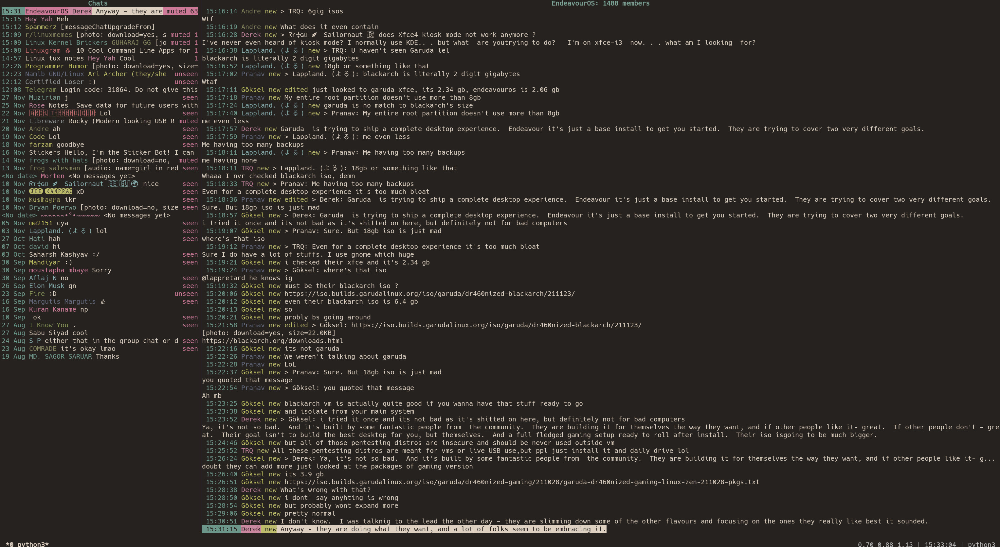

# Arigram

> This is not an actively-developed project as of now, meaning don't
> expect much stuff now, I might start working on it again, although it
> works for me so I use it, anyways, I'm rlly sorry, kthxbye :)

A fork of [tg](https://github.com/paul-nameless/tg) -- a hackable telegram TUI client




## Features

- [X] view media: photo, video, voice/video notes, documents
- [X] ability to send pictures, documents, audio, video
- [X] reply, edit, forward, delete, send messages
- [X] stickers
- [X] notifications
- [X] record and send voice messages
- [X] auto download files
- [X] toggle chats: pin/unpin, mark as read/unread, mute/unmute
- [X] message history
- [X] list contacts
- [X] show user status
- [X] secret chats
- [x] automation
- [x] better default file picker
- [x] custom keybindings
- [x] consistent styling
- [x] drafts
- [ ] scheduled messages
- [ ] polls
- [ ] local passwords (maybe GPG?)
- [x] debug mode
- [ ] modules/addons
- [ ] stickers (sticker keyboard)
- [ ] less crowded UI
- [ ] search (for users)
- [ ] bots (bot keyboard)
- [ ] profile pictures
- [ ] message/chat archiving
- [ ] better error reporting
- [ ] joining of groups and channels based on t.me links and @s


## Requirements

To use tg, you'll need to have the following installed:

- [Python >= 3.8](https://www.python.org/downloads/)


## Optional dependencies

- [terminal-notifier](https://github.com/julienXX/terminal-notifier) - for Mac (used by default). You can change it to [dunst](https://github.com/dunst-project/dunst) for Linux or any other notifications program (see `NOTIFY_CMD` in configuration)
- [ffmpeg](https://ffmpeg.org/) - to record voice msgs and upload videos.
- [tdlib](https://tdlib.github.io/td/build.html?language=Python) - in case of incompatibility with built in package.
  For example, macOS:
  ```sh
  brew install tdlib
  ```
  and then set in config `TDLIB_PATH`.
- macOS arm64: you can also manually put the tdlib prebuilt (tdlib-arm64-prebuilts/libtdjson.dylib) in `/usr/local/lib`.
- `urlview` to choose urls when there is multiple in message, use `URL_VIEW` in config file to use another app (it should accept urls in stdin)
- to open `stickers` and `animated` ones (thumbnail preview) you need to set in mailcap appropriate handler and have app which will open `webp` file:
  ```ini
  image/webp; mpv %s
  ```
- [ranger](https://github.com/ranger/ranger), [nnn](https://github.com/jarun/nnn), [fzf](https://github.com/junegunn/fzf) - can be used to choose file when sending, customizable with `FILE_PICKER_CMD`
- [fzf](https://github.com/junegunn/fzf) - to create groups and secret chats (used for single and multiple user selection)

## Installation

### Homebrew

```sh
brew tap TruncatedDinosour/dino-bar
brew install arigram
```

### From sources

This option is recommended:

```sh
mkdir -p ~/.local/src
cd ~/.local/src
git clone https://github.com/TruncatedDinosour/arigram.git
cd arigram
./do local
```

#### Optionally install the desktop entry

```sh
$ sudo ./do entry
```

And add this to `~/.bashrc` or whatever POSIX complient shell you use:

```sh
export PATH="${PATH}:${HOME}/.local/bin"
```

To Launch it

```sh
arigram
```

## Upgrading

### Homebrew

```sh
brew upgrade
```

### From sources

This option is recommended:

```sh
cd ~/.local/src/arigram
git reset --hard  # This discards every change you made locally
git pull
./do upgrade
```

or if you want to keep local changes

```sh
cd ~/.local/src/arigram
./do local
```

## Configuration

Config file should be stored at `~/.config/arigram/config.py`. This is simple python file.

### Simple config:

```python
# should start with + (plus) and contain country code
PHONE = "[phone number in international format]"
# For enable `PHONE = "+1234567890"`
```

### Advanced configuration:

All configurable variables can be found [here](/arigram/config.py)

```python
import os
from arigram.controllers import msg_handler
from plyer import notification
from arigram import config as tg_config
from simpleaudio import WaveObject
from threading import Thread


class Custom:
    def _play_wav(self, wave_path: str) -> Thread:
        def player() -> None:
            wave_obj = WaveObject.from_wave_file(wave_path)
            play_obj = wave_obj.play()
            play_obj.wait_done()

        sound = Thread(target=player)
        sound.setDaemon(True)

        return sound

    def _notify(self, title: str, message: str) -> Thread:
        def notifier() -> None:
            notification.notify(
                app_name=f"arigram {arigram.__version__}", title=title, message=message
            )

        notif = Thread(target=notifier)
        notif.setDaemon(True)

        return notif

    def notify(self, *args, **kwargs) -> None:
        del args

        self._notify(str(kwargs.get("title")), str(kwargs.get("msg"))).start()
        self._play_wav(f"{tg_config.CONFIG_DIR}resources/notification.wav").start()


# You can write anything you want here, file will be executed at start time
# You can keep you sensitive information in password managers or gpg
# encrypted files for example
def get_pass(key):
    # retrieves key from password store
    return os.popen("pass show {} | head -n 1".format(key)).read().strip()

# Custom methods (doesn't need to be named "custom")
c = Custom()


PHONE = get_pass("i/telegram-phone")
# encrypt you local tdlib database with the key
ENC_KEY = get_pass("i/telegram-enc-key")

# log level for debugging, info by default
LOG_LEVEL = "DEBUG"
# path where logs will be stored (all.log and error.log)
LOG_PATH = os.path.expanduser("~/.local/share/tg/")

# If you have problems with tdlib shipped with the client, you can install and
# use your own, for example:
TDLIB_PATH = "/usr/local/Cellar/tdlib/1.8.0/lib/libtdjson.dylib"

# A callback to notify a user,
# Arguments get passed in kwargs
NOTIFY_FUNCTION = c.notify

# You can use your own voice recording cmd but it's better to use default one.
# The voice note must be encoded with the Opus codec, and stored inside an OGG
# container. Voice notes can have only a single audio channel.
VOICE_RECORD_CMD = "ffmpeg -f avfoundation -i ':0' -c:a libopus -b:a 32k {file_path}"

# You can customize chat and msg flags however you want.
# By default words will be used for readability, but you can make
# it as simple as one letter flags like in mutt or add emojies
CHAT_FLAGS = {
    "online": "●",
    "pinned": "P",
    "muted": "M",
    # chat is marked as unread
    "unread": "U",
    # last msg haven't been seen by recipient
    "unseen": "✓",
    "secret": "🔒",
    "seen": "✓✓",  # leave empty if you don't want to see it
}
MSG_FLAGS = {
    "selected": "*",
    "forwarded": "F",
    "new": "N",
    "unseen": "U",
    "edited": "E",
    "pending": "...",
    "failed": "💩",
    "seen": "✓✓",  # leave empty if you don't want to see it
}

# use this app to open url when there are multiple
URL_VIEW = 'urlview'

# Specifies range of colours to use for drawing users with
# different colours
# this one uses base 16 colors which should look good by default
USERS_COLOURS = tuple(range(2, 16))

# to use 256 colours, set range appropriately
# though 233 looks better, because last colours are black and gray
# USERS_COLOURS = tuple(range(233))

# to make one colour for all users
# USERS_COLOURS = (4,)

# cleanup cache
# Values: N days, None (never)
KEEP_MEDIA = 7

FILE_PICKER_CMD = "ranger --choosefile={file_path}"
# FILE_PICKER_CMD = "nnn -p {file_path}"

MAILCAP_FILE = os.path.expanduser("~/.config/mailcap")

DOWNLOAD_DIR = os.path.expanduser("~/Downloads/")  # copy file to this dir

def send_hello(ctrl, *args) -> None:
    # ctrl = the current Controller class instance
    ctrl.model.send_message(text=f"Hello people!")  # Sends a message

# CUSTOM_KEYBINDS = {"KEY": {"func": SOME_FUNCTION, "handler": CONTEXT_HANDLER}}
CUSTOM_KEYBINDS = {"z": {"func": send_hello, "handler": msg_handler, "repeat": False, "is_remap": False}}

# What to add before file picker (while using fzf (default))
EXTRA_FILE_CHOOSER_PATHS = ["..", "/", "~"]

# This is the max truncation limit when truncating paths, messages, etc.
TRUNCATE_LIMIT = 10

# If you set this to True this will automatically disable link previews
# WARNING: only do this if you know what you are doing, this is a dangerous option
EXTRA_TDLIB_HEADERS = {"disable_web_page_preview": True}

# Where to store your drafts
DRAFTS_FILE = "/tmp/.drafts.json"

# This defines if stuff like \n (Unicode escapes)
# get interpreted literally (False) or get decoded
# into an escape and you get a newline (True)
DECODE_INPUT_ESCAPES = False
```

### Mailcap file

Mailcap file is used for deciding how to open telegram files (docs, pics, voice notes, etc.). Path to the file can be overriden with `MAILCAP_FILE` in config file.

Example: `~/.mailcap`

```ini
# media
video/*; mpv "%s"
audio/ogg; mpv --speed=1.33 "%s"
audio/mpeg; mpv --no-video "%s"
image/*; qview "%s"

# text
text/html; w3m "%s"
text/html; open -a Firefox "%s"
text/plain; less "%s"

# fallback to vim
text/*; vim "%s"
```


## Keybindings

ViM like keybindings are used in the project. Can be used commands like `4j` - 4 lines down.

### Chats:

- `j,k`: move up/down
- `J,K`: move 10 chats up/down
- `g`: go to top chat
- `l`: open msgs of the chat
- `m`: mute/unmute current chat
- `p`: pin/unpin current chat
- `u`: mark read/unread
- `r`: read current chat
- `c`: show list of contacts
- `dd`: delete chat or remove history
- `ng`: create new group chat
- `ns`: create new secret chat
- `/`: search in chats
- `?`: show help

## Msgs:

- `j,k`: move up/down
- `J,K`: move 10 msgs up/down
- `G`: move to the last msg (at the bottom)
- `D`: download file
- `l`: if video, pics or audio then open app specified in mailcap file, for example:

```ini
# Images
image/png; qView "%s"
audio/*; mpv "%s"
```

If text, open in `less` (to view multiline msgs)
- `e`: edit current msg
- `<space>`: select msg and jump one msg down (use for deletion or forwarding)
- `<ctrl+space>`: same as space but jumps one msg up
- `y`: yank (copy) selected msgs with <space> to internal buffer (for forwarding) and copy current msg text or path to file to clipboard
- `p`: forward (paste) yanked (copied) msgs to current chat
- `dd`: delete msg for everybody (multiple messages will be deleted if selected)
- `i or a`: insert mode, type new message
- `I or A`: open vim to write long msg and send
- `v`: record and send voice message
- `r,R`: reply to a current msg
- `sv`: send video
- `sa`: send audio
- `sp`: send picture
- `sd`: send document
- `o`: open url present in message (if multiple urls, `urlview` will be opened)
- `]`: next chat
- `[`: prev chat
- `u`: show user info (username, bio, phone, etc.)
- `c`: show chat info (e.g. secret chat encryption key, chat id, state, etc.)
- `?`: show help
- `!`: open msg with custom cmd

## Publish

Run script to automatically increase version and release

```sh
./do release
```
